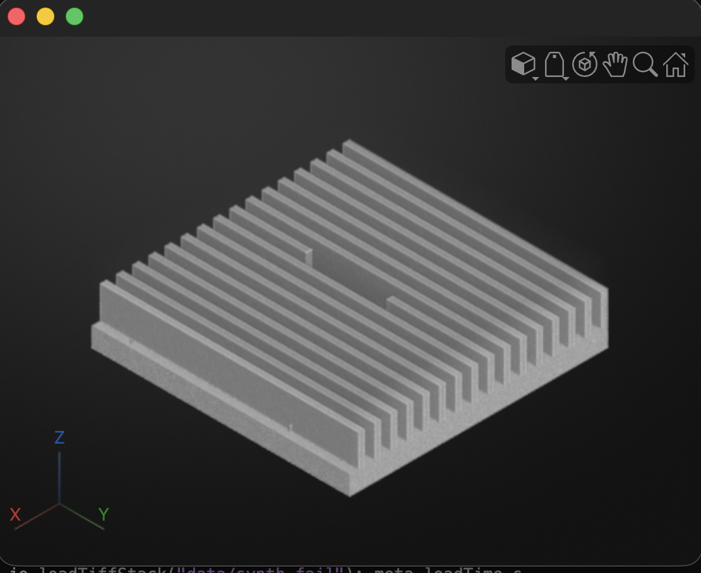
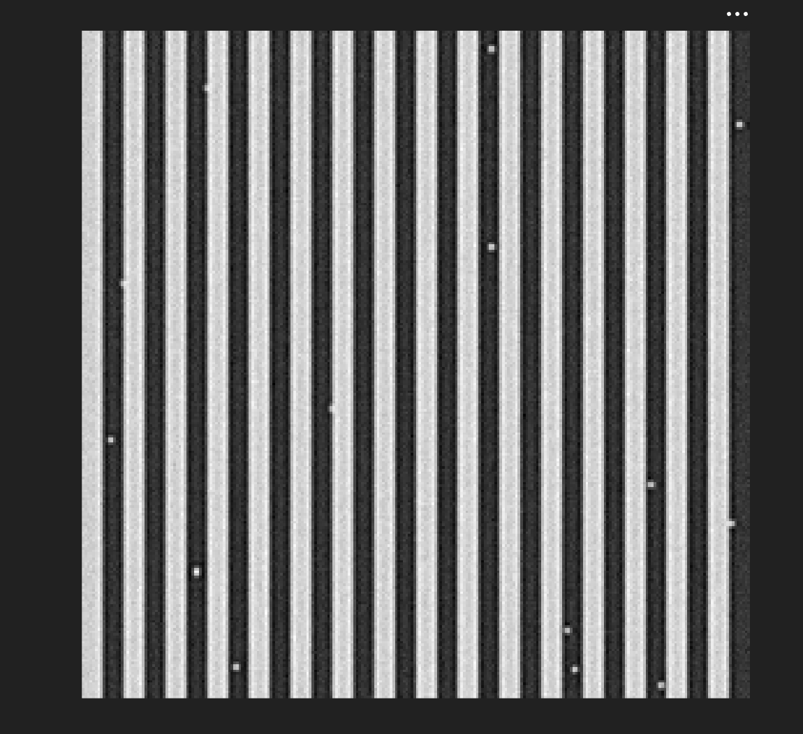

# WaferInspector

Automatyczna inspekcja NDT siatek DRIE na krzemie (pitch 8 µm, linia 4 µm, głębokość 12,8 / 16 µm) ze skanów kontrastu fazowego z synchrotronu NanoTerasu. Wynik: PASS / FAIL względem tolerancji geometrycznych.

## Status
- [x] Tydzień 1: loader stosów 16-bit TIFF, generator syntetycznych danych z defektami, 15 testów jednostkowych
- [ ] Tydzień 2: preprocessing (normalizacja, odszumianie)

## Start
```matlab
addpath("src")
gt = synth.makeSyntheticGratingStack("data/synth_fail");                  % z defektami
synth.makeSyntheticGratingStack("data/synth_pass", Defects=strings(0));   % bez defektów
[vol, meta] = io.loadTiffStack("data/synth_fail");
volshow(vol)
table(runtests("tests"))
```

## Benchmark
Sprzęt: MacBook Pro M4 Pro, MATLAB

| Dane | Rozmiar | Czas wczytania |
|---|---|---|
| synth_fail | 256 × 256 × 80, uint16 | 0,06 s |

## Podgląd


